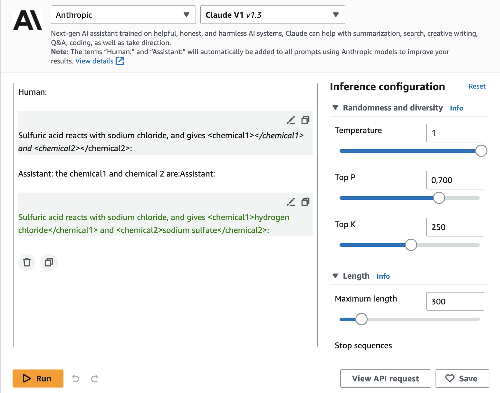
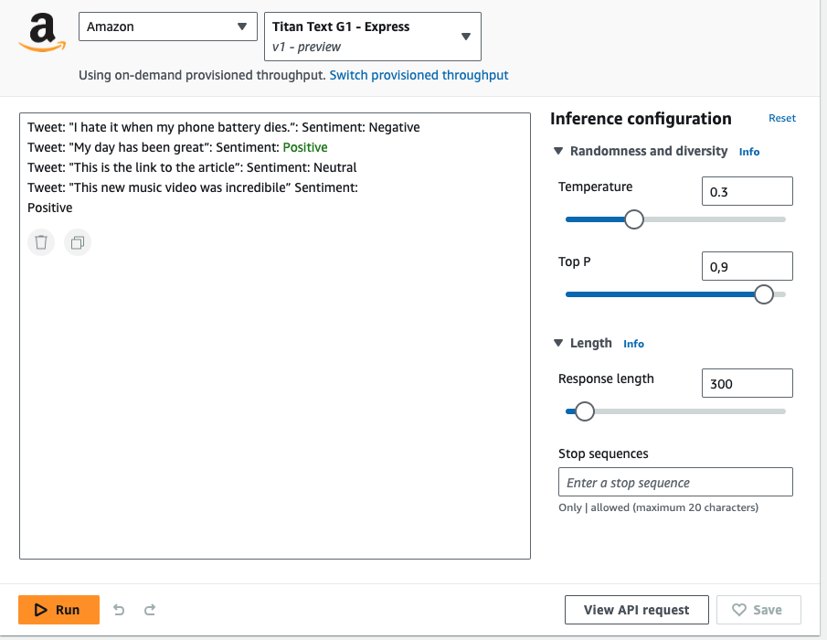

This lab will walk you through the basics of connecting to the Amazon Bedrock service from Python.

First, ensure you've completed the setup in the ['Getting Started' section of the root README](../README.md#Getting-started)

Then, you'll be ready to walk through the notebook [bedrock_boto3_setup.ipynb](bedrock_boto3_setup.ipynb), which shows how to install the required packages, connect to Bedrock, and invoke models. Before running any of the labs ensure you've run the [Bedrock boto3 setup notebook](../00_Intro/bedrock_boto3_setup.ipynb#Prerequisites).

# Prompt Engineering
## Overview
Prompt engineering is an emerging discipline focused on developing optimized prompts to efficiently apply language models to various tasks. Prompt engineering helps researchers understand the abilities and limits of large language models (LLMs). By using various prompt engineering techniques, we can often get much better answers from the foundation models without spending effort and cost on retraining or fine-tuning the models.

Note that prompt engineering does not involve fine-tuning the model. In fine-tuning the weights/parameters are adjusted using training data with the goal of optimizing a cost function. It is generally an expensive process both in terms of computation time and actual cost. Prompt engineering instead attempts to guide the trained foundation model (FM) to give us more relevant and accurate answers by using various methods such as better worded questions, similar examples, intermediate steps and logical reasoning, etc.

Prompt Engineering leverages the principle of “priming”, this means that the model is given a context, some (3-5) examples of what the user expects the output to look like and then provide the input for the model to mimic the previously “primed” behavior. By interacting with the LLM through a series of questions, statements, or instructions, users can effectively guide the LLMs understanding and adjust its behavior according to the specific context of the conversation.

In short, prompt engineering is a new and important field for optimizing how we apply, develop, and understand language models, especially large models. At its core, it is about designing prompts and interactions to expand what language technologies can do, address their weaknesses, and gain insights into their functioning. Prompt engineering equips us with strategies and techniques for pushing the boundaries of what is possible with language models and their applications.
## Prompt Engineering Patterns
### Zero-Shot
Zero Shot prompting describes the technique where we present a task to an LLM without giving it further examples. We therefore, expect it to perform the task without getting a prior look at a “shot” at the task. Hence, “zero-shot” prompting. Modern LLMs demonstrate remarkable zero-shot performance and a positive correlation can be drawn between model size and zero-shot performance.

``` Human: 
Sulfuric acid reacts with sodium chloride, and gives <chemical1>_____</chemical1> and <chemical2>_____</chemical2>:
Assistant: the chemical1 and chemical 2 are:
```

Example executed on Amazon Bedrock playground, with Anthropic Claude model:



### Few-Shot
Giving the model more information about the tasks at hand via examples is called Few-Shot Prompting. It can be used for in-context learning by providing examples of the task and the desired output. We can therefore condition the model on the examples to follow the task guidance more closely.

```
Tweet: "I hate it when my phone battery dies.”: Sentiment: Negative
Tweet: "My day has been great”: Sentiment: Positive
Tweet: "This is the link to the article”: Sentiment: Neutral
Tweet: "This new music video was incredible” Sentiment:
```

Example executed in the Amazon Bedrock playground, using the Amazon Titan model.



### Chain-of-Thought (with Few-Shot)
Chain-of-Thought (CoT) prompting breaks down complex reasoning tasks through intermediary reasoning steps. Chain-of-Thought prompts are usually very specific to a problem type. One can try to invoke CoT reasoning by using the trigger phrase "(Think Step-by-Step)". Let's examine the following example of a few-shot CoT prompt.

**Hint**: You can test following prompt in Amazon Bedrock playground with distinct models

```
On a given week, the viewers for a TV channel were
Monday: 6500 viewers
Tuesday: 6400 viewers
Wednesday: 6300 viewers


Question: How many viewers can we expect on Friday?
Answer: Based on the numbers given and without any more information, there is a daily decrease of 100 viewers. If we assume this trend will continue during the following days, we can expect 6200 viewers on the next day that would be Thursday, and therefore 6100 viewers on the next day that would be Friday.


Question: How many viewers can we expect on Saturday? (Think Step-by-Step)
Answer:
```

Answer provided by Anthropic Claude model:

```
Here are the step-by-step workings:

1. Monday viewers: 6500
2. Tuesday viewers: 6400 (decrease of 100 from Monday)
3. Wednesday viewers: 6300 (decrease of 100 from Tuesday)

We see a daily decrease of 100 viewers from the previous day.

4. Following the trend, Thursday viewers: 6200 (decrease of 100 from Wednesday) 
5. Friday viewers: 6100 (decrease of 100 from Thursday)
6. For Saturday, we continue the decreasing trend and subtract another 100 viewers from Friday:

Saturday viewers: 6000 (decrease of 100 from 6100 on Friday)
So based on the decreasing trend of 100 viewers per day, we can estimate 6000 viewers on Saturday.
The step-by-step workings are:

Monday: 6500 
Tuesday: 6400  (6500 - 100)
Wednesday: 6300 (6400 - 100)
Thursday: 6200 (6300 - 100) 
Friday: 6100 (6200 - 100)
Saturday: 6000 (6100 - 100)

Does this make sense? Let me know if you need any clarification.
```

## Conclusion
You have learned examples of how to engineer prompts to get better results from models. These examples are just a few of the options that prompt engineering can provide. You can test other options in the Amazon Bedrock playground.


