# Introduction

An LLM agent utilizes a large language model (LLM) to extend the core capabilities of an LLM beyond text generation.  An LLM Agent is capable of performing conversations, completing tasks, reasoning, and can demonstrate some degree of autonomous behavior.

## Agents for Amazon Bedrock

Agents for Amazon Bedrock allows you to build and configure autonomous agents in your application. The agent helps your end-users complete actions based on organization data and user input. Agents orchestrate interactions between foundation models, data sources, software applications, and user conversations, and automatically call APIs to take actions and invoke knowledge bases to supplement information for these actions. Developers can easily integrate the agents and accelerate delivery of generative AI applications saving weeks of development effort.

You can use Agents for Bedrock to carry out the following tasks:

* Extend foundation models to understand user requests and break down the tasks it needs to perform into smaller steps.
* Collect additional information from a user through natural conversation.
* Take actions to fulfill a customer's request.
* Make API calls to your company systems to carry out actions.
* Augment performance and accuracy by querying data sources.
* Carry out source attribution.

In this lab, we’ll use Agents for Bedrock to help game users provide answers to their questions. We’ll provide tools for the Agent so that it could take action on behalf of the user to provide accurate responses. 

Here is a high level details about the components involved in this lab:

* LLM Foundation Model - Anthropic Claude v2.1
* LLM Agent - Amazon Bedrock Agent
* Tools  - [IGDB API](https://api-docs.igdb.com/#getting-started)
* Knowledge Base: Amazon OpenSearch Serverless
* Sample Chatbot Frontend UI: [streamlit](https://streamlit.io/)

## Prerequisites

Before building our application, let’s deploy a few core components to allow Bedrock Agent to start leveraging tools and APIs. 

Note: Depending on how the lab is delivered, this step could already been done by the cloud admin ahead of the lab. If that’s the case, you can skip the following steps and start with the lab.


1. git clone https://github.com/aws-samples/bedrock-genai-workshop
2. cd 05_Agent/lambda, and run ./build.sh [ an s3 location where the lambda zip file will be stored.]. 
3. in the same folder, run the cloudformation stack to create the lambda function: (replacing the client_id and access tokens with the values to be provided by your instructor.

    ```
    aws cloudformation create-stack --stack-name bedrock-genai-workshop-stack --template-body file://${PWD}/cloudformation.yaml --parameters ParameterKey=IGDBClientID,ParameterValue=[val] ParameterKey=IGDBAccessToken,ParameterValue=[val] ParameterKey=S3BucketName,ParameterValue=[S3 bucket name] ParameterKey=S3Key,ParameterValue=bedrock/agent/action_group1/bedrock_agent_action_group1_lambda_package.zip --capabilities CAPABILITY_NAMED_IAM
    ```
4. Verify that the lambda function is created successfully:

    ```
    aws cloudformation describe-stacks --stack-name bedrock-genai-workshop-stack
    ```

5. upload the open-api.json file to S3:

``` 
cd agent
aws s3 cp open-api.json s3://[your S3 bucket name]/bedrock/agent/action_group1/open-api.json]
```

6. Make a note of the following outputs from the steps above. You’ll need to reference them in the subsequent steps:

    a. IAM Role in the CloudFormation template (i.e. should start with AmazonBedrockExecutionRoleForAgents_) \
    b. Lambda Function created in the Cloudformation template: (i.e. BedrockAgentActionGroup1)\
    c. S3 location path for the open-api.json 

## Instructions

1. Navigate to Amazon Bedrock Console, and select Bedrock Agent in the left panel:

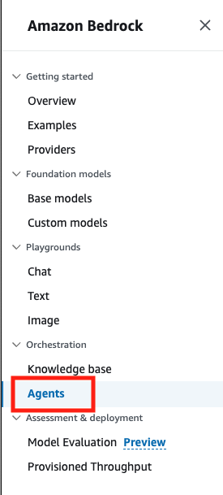

2. Click **Create new Agent** button: 

3. Provide the following details to create an Agent:

    **Agent Name**: <unique-id>-bedrock-agent-workshop\
    **Agent Description**: An LLM Agent for helping users in a typical gaming use case.\
    **User Input**: Yes\
    **IAM Permissions**: Select the IAM Execution Role created in the cloudformation template above.

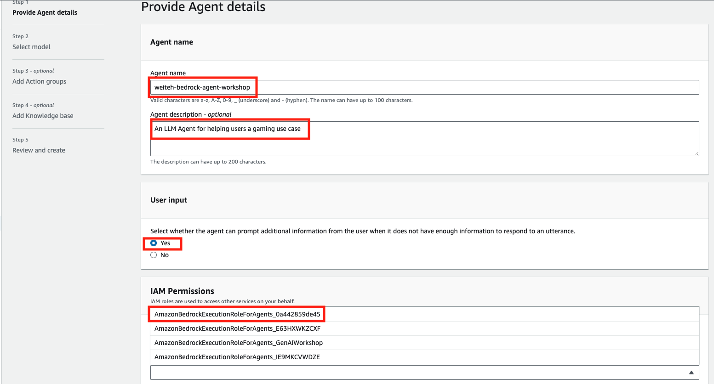

Leave the rest of the details as default, then click **Next**.


4. Provide Model Details as followed:
    1. Anthropic Claude v2.1;
    2. Instruction For Agent: 

>You are a helpful assistant with the goal of helping video game customers answer any questiosn. Your task is to answer human questions as best you can using the tools that are available to you, including games, genres, ratings, characters.

5. Add an action group with the following detail:

    a. Action Group Name: action-group-1\
    b. Description: Action Group that performs actions based on user query\
    c. Select Lambda function: [the lambda function created in the Cloudformation template e.g. BedrockAgentActionGroup1]\
    d. Select API Schema: The S3 URL where the open-api.json was uploaded.\

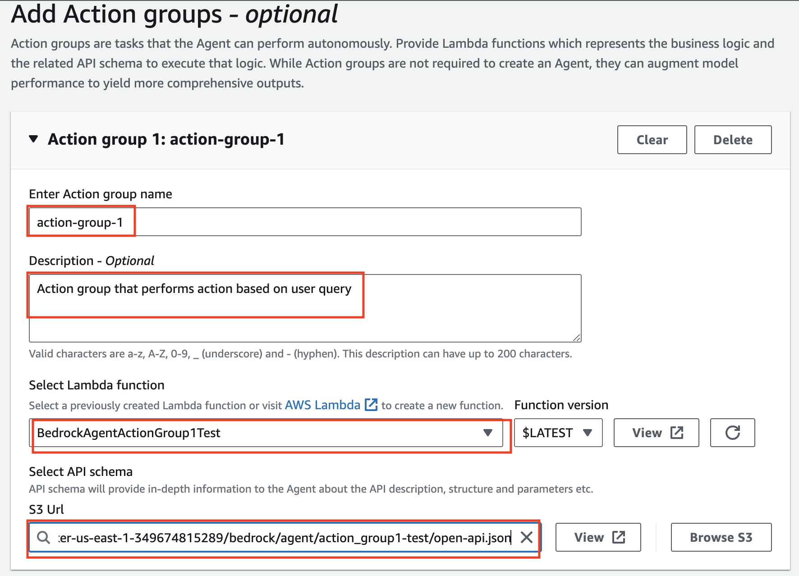

6. ""Next""
7. Click "**Create Agent**" to complete the agent creation process.


## Test the Agent

By default, when you first create an agent, Bedrock associates the agent with a working draft version with an alias named TestAlias . The working draft is a version of the agent that you can use to iteratively build the agent. By default, you can interact with the working draft with the TestAlias. Additionally, you can also select a different alias to test using different configuration. 

After our agent is created successfully, we can now do a quick test by interacting it via the test window. The test will help us validate the agent understanding of the user question, orchestrating the steps and connects to appropriate lambda function created in the previous step. 

Let’s start by asking the following question: 

**Question**: *show me all game genres*

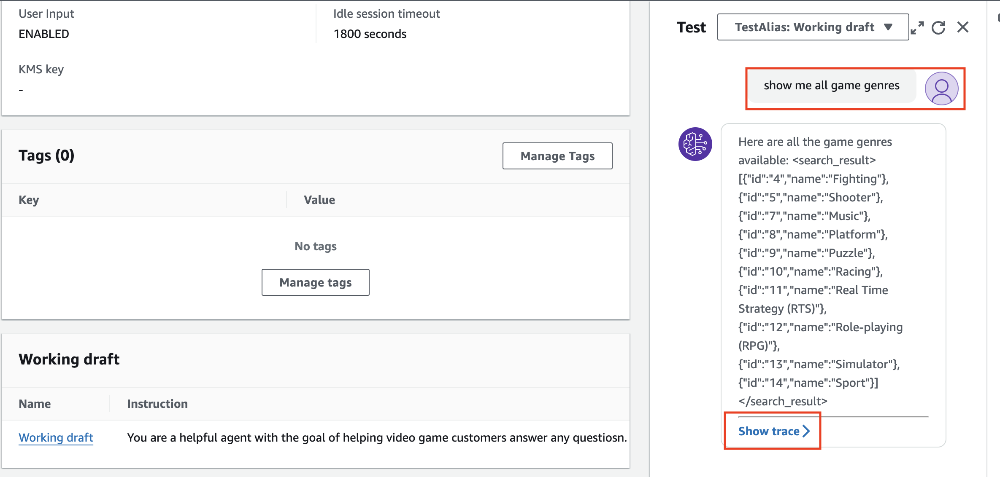


## Bedrock Agent Execution Workflow
The agent is triggered when the user asks a question. Essentially, this process involves taking 3 main steps outlined as followed:

* Pre-processing – Manages how the agent contextualizes and categorizes user input and whether the input is valid.
* Orchestration – Interprets the user input, invokes action groups and queries knowledge bases, and returns output to the user or as input to continued orchestration. This loop continues until the agent is ready to return a response to the user or until it needs to prompt the user for extra information.
* Post-processing – The agent creates a final response from parts of the API and knowledge base responses. This step is turned off by default.

**Note**: The conversation history is preserved and serves to continually augment the orchestration base prompt template with context, helping improve accuracy and performance. The following diagram schematizes the agent's process during runtime.

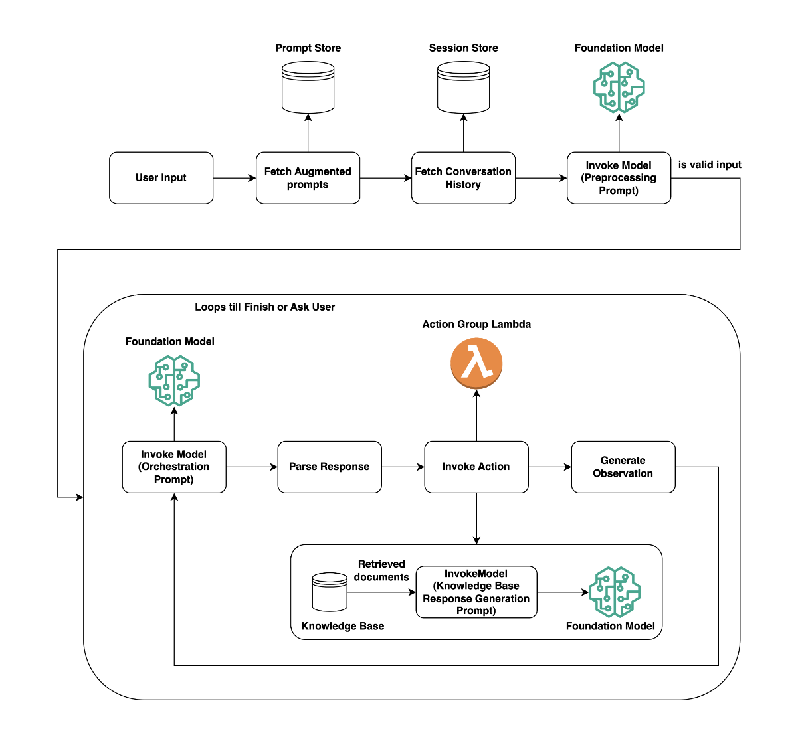

## Trace the Agent

In the test window, you can choose to show the trace for each response. The trace shows the agent's reasoning process, step-by-step, and is a useful tool for debugging your agent. When you show the trace in the test window in the console, a window appears showing a trace for each Step in the reasoning process. Each Step can be one of the following traces:


* PreProcessingTrace – Traces the input and output of the pre-processing step, in which the agent contextualizes and categorizes user input and determines if it is valid.
* OrchestrationTrace – Traces the input and output of the orchestration step, in which the agent interprets the input, invokes APIs and queries knowledge bases, and returns output to either continue orchestration or to respond to the user.
* PostProcessingTrace – Traces the input and output of the post-processing step, in which the agent handles the final output of the orchestration and determines how to return the response to the user.
* FailureTrace – Traces the reason that a step failed.

To learn more about the trace, see [Trace events](https://docs.aws.amazon.com/bedrock/latest/userguide/trace-events.html). To learn how to enable the trace through the API, see Invoke your agent.

Let's click on the Show trace link to dive into more detail.

### Preprocessing Trace
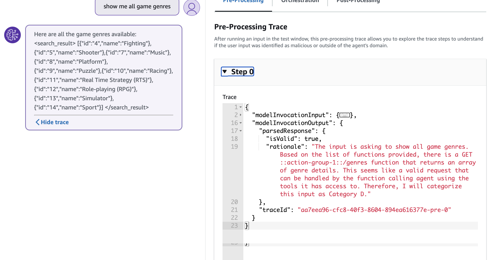

### Orchestration Step 1

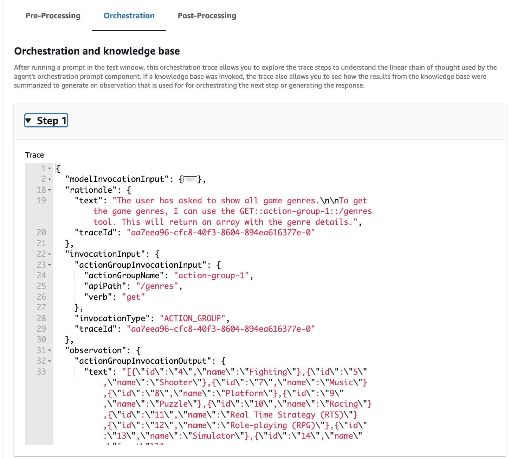

### Orchestration Step 2

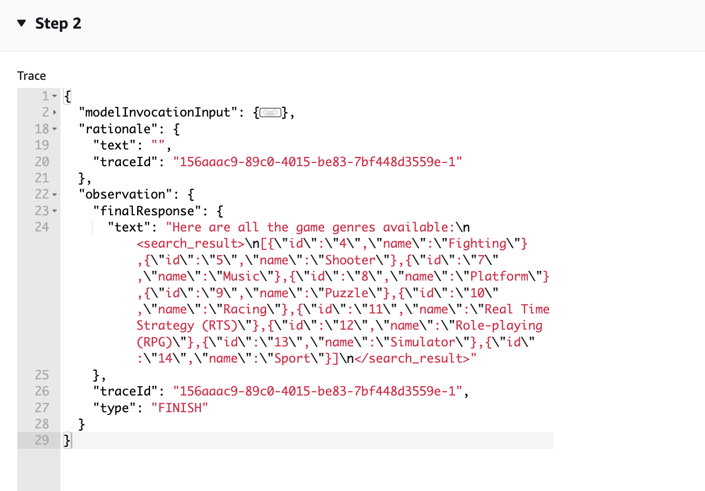


## Advanced Prompt

The prompts which the Bedrock Agent used in orchestrating the steps and response above was defined in a default prompt template provided by Bedrock Agent. With advanced prompt, you can gain more control over the behavior of the agent by defining and configuring prompt templates for your agent. You could customize the preprocessing, orchestration, knowledge base and outputs steps to adapt the LLM interaction based on your requirements. 

In our example, since we saw the output from the model produces a list of elements in HTML format, we will provide a custom prompt to help the Agent format the response. 


### Instructions

1. Navigate to the Bedrock Agent Console, select the Working Draft as shown below:

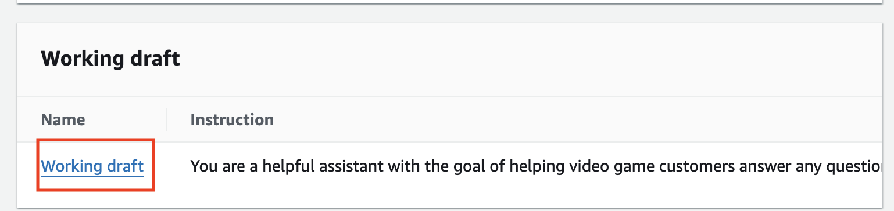

2. Navigate to Advanced Prompt and click Edit:

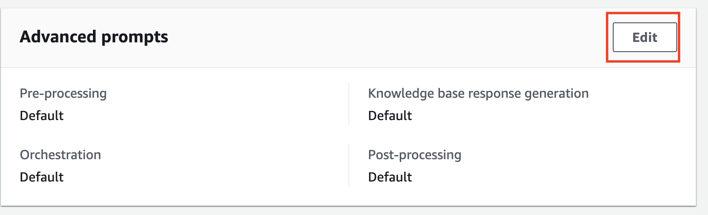

3. In the Orchestration Tab, click on **Override orchestration template results**

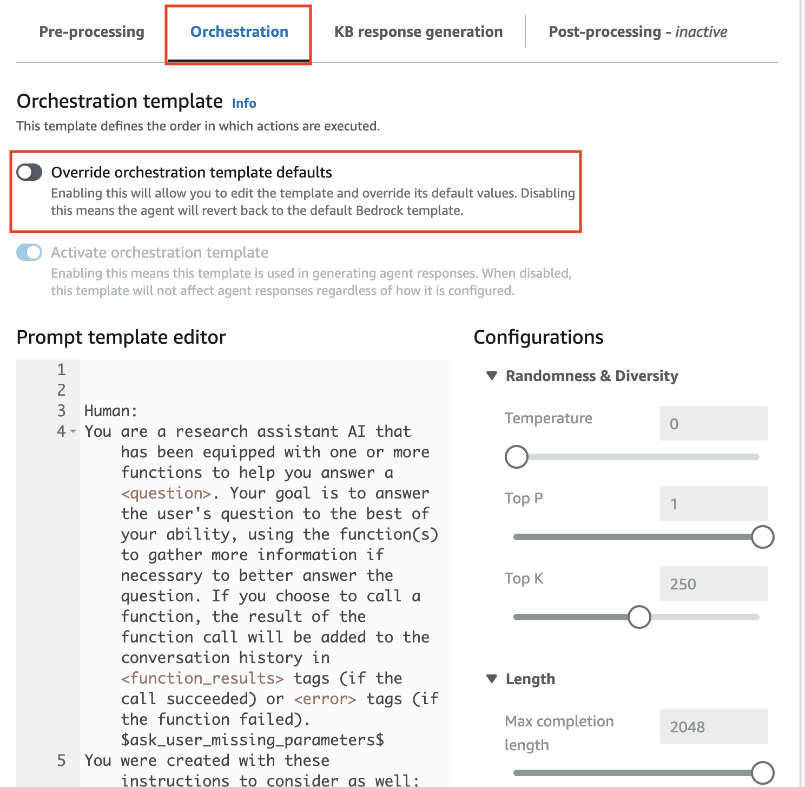

Click **Confirm** in the pop up window to override the default Orchestration prompt:

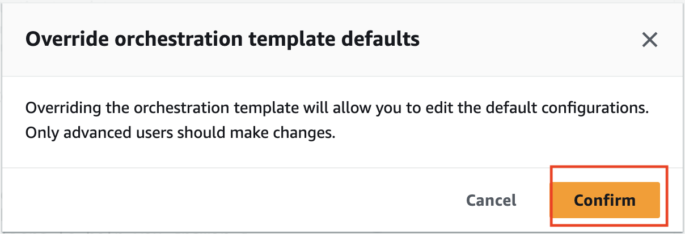


4. In your JupyterLab workspace within SageMaker Studio, from the project root folder, navigate to *05_Agent/agent* folder, open "orchestration-template.xml" file as shown below:

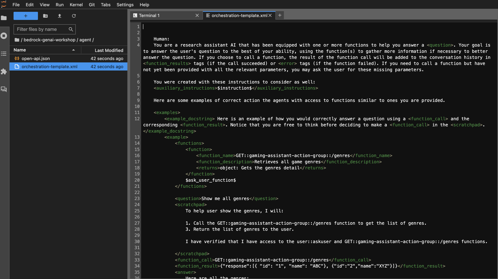

5. Copy the entire xml content by right clicking on the file on the right hand side, **"Select all"**, then **"Copy"**.

6. Paste the custom orchestration prompt by navigating back to the Bedrock Agent Advance Prompt Orchestration Window, “right click” the prompt template, then **"Select All"**, then “Paste”. Leaving everything else as default, scroll to the bottom and click **"Save And Exit"**.

7. We need to update the Agent with the new prompt template. On the Agent Test Window, there should be a **"Prepare"** button. Click on it to reload the new prompt template that we just provided as followed:

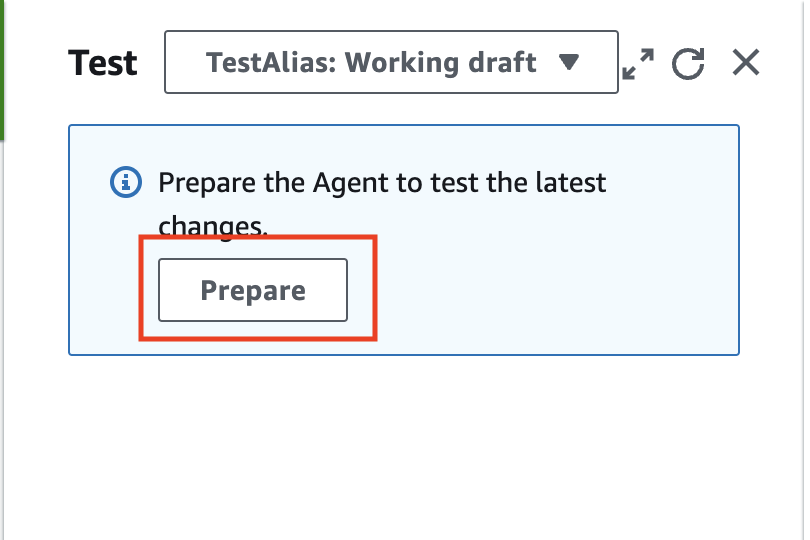

8. Let’s try with the same question again: show me all game genres The output should now contain more human readable format, as shown in the following:

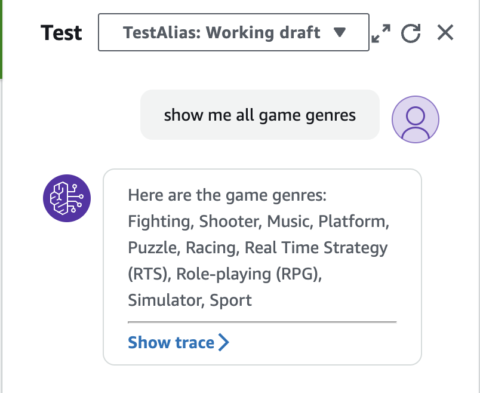

## Knowledge Base integration

In addition to action groups, you could also integrate Knowledge Base with Bedrock Agent. In this lab, we’ll reuse the same Bedrock KnowledgeBase setup in the previous lab. With KnowledgeBase integration, the Bedrock Agent is better equipped to support user questions with more accuracy answers, such as semantic search capabilities. 

### Instructions

1. From the Agents window, click on the Working draft as shown below:


2. Scroll down to Knowledge Bases, select **Add**

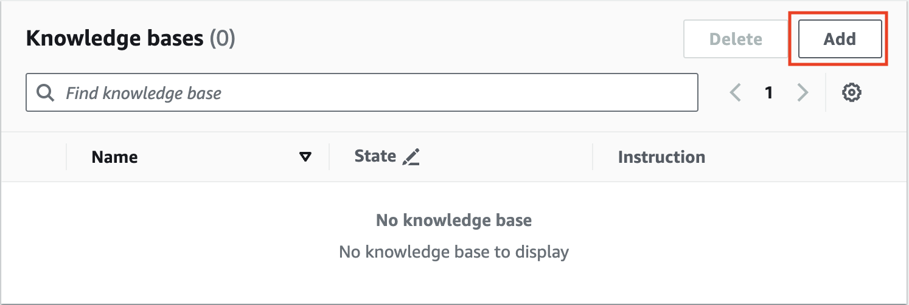

3. Choose the knowledge base from the dropdown list under **Select knowledge base** and specify the instructions for the agent regarding the knowledge base.

    a. In the drop down select the knowledge base created in the previous lab.\
    b. Under the text area, provide the following instruction to the Knowledge base in the text area:

>Use this knowledge base to help users find similar game based on game titles, find the matching game Id for any game title, and provide game summaries.

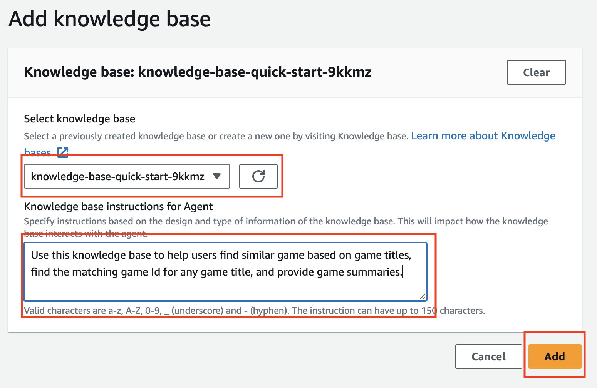

4. In the Test Window, click Prepare to complete the Knowledge Base integration with the Agent:


5. In the test window, enter a question: show me a game summary for "LEGO Marvel Super Heroes 2". Response is shown as followed:

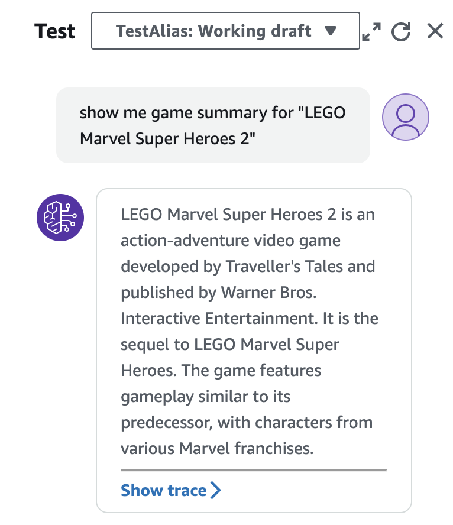


## Deploy the Agent

So far, we’ve tested various Bedrock Agent capabilities, including Action Groups, Advance Prompts and Knowledge Bases. In the next section, we’ll deploy the Agent and integration it into a sample chatbot application by creating an alias for the agent.
When creating an alias, Amazon Bedrock automatically creates a version of your agent. The version is a snapshot that preserves the resource as it exists at the time it was created. You can continue to modify the working draft and create new aliases (and consequently, versions) of your agent as necessary to iterate on the Agent development. Please note that a version acts as a snapshot of your agent at the time you created it, therefore it is immutable.

### Instructions

1. Navigate back to the Agent console, select **Add**

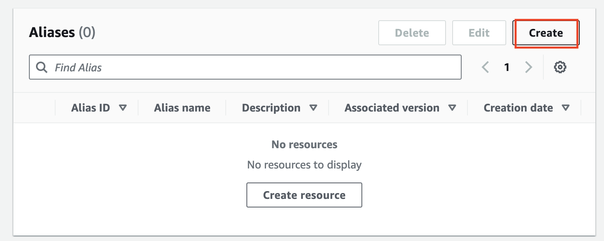

2. Provide a unique name and optionally a description, then click Create Alias
    a. Once the Alias is created successfully, a new entry will show up under the Aliases section. Please make a note of the Alias ID as we’ll need it to deploy our chatbot application in the next section.

    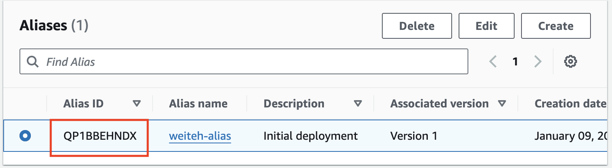
    

3. Make a note of the **Agent ID** from the your Agent console. The Agent ID is needed to invoke the agent in our chatbot application.

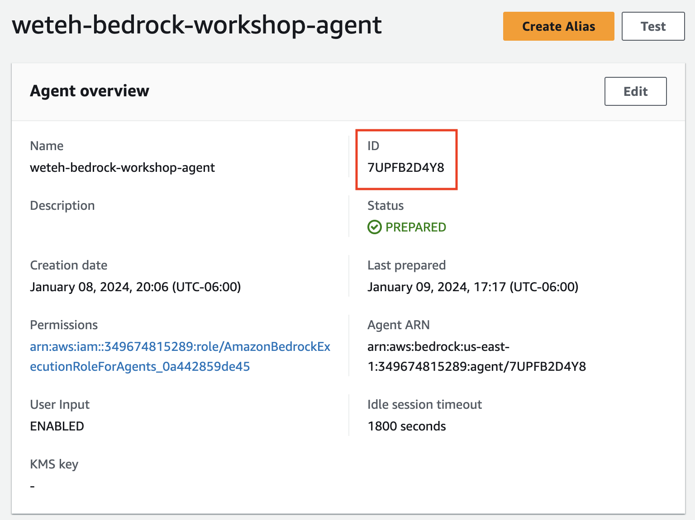

## Deploy a Sample Chatbot

Given we have successfully deployed a Bedrock Agent, we can use it to build an application. In this section, we’ll focus on deploying a chatbot and integrate it with the Agent Alias that we just created in the previous step.

### Instructions

1. In the SageMaker Studio Jupyterlab environment, open a terminal, run the following command:

```
cd bedrock-genai-workshop/05_Agent/ui
pip install -U -r requirements.txt
export BEDROCK_AGENT_ID=[The Agent ID captured in the previous step]
export BEDROCK_AGENT_ALIAS=[The Agent Alias ID captured in the previous step]
streamlit run chatbot.py
```

2. You should see the outputs similar to the following:

```
sagemaker-user@default:~/bedrock-genai-workshop/ui$ streamlit run chatbot.py

Collecting usage statistics. To deactivate, set browser.gatherUsageStats to False.


You can now view your Streamlit app in your browser.

Network URL: http://169.255.255.2:8501
External URL: http://52.4.240.77:8501
```

3. Open a new browser tab, copy the original URL from your SageMaker Studio (e.g. https://0g94sknlzkdqnij.studio.us-east-1.sagemaker.aws/jupyterlab/default/lab) and paste to a new tab, modify the last path in the URL and replace it with **/proxy/8501/** . For example: https://0g94sknlzkdqnij.studio.us-east-1.sagemaker.aws/jupyterlab/default/proxy/8501/ (make sure there is a trailing / at the end). You should see the chatbot running:

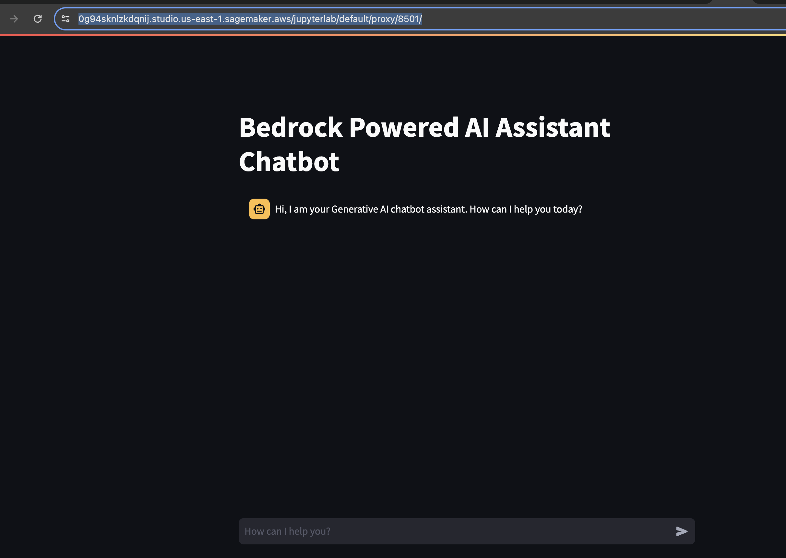


4. That’s it! You have successfully deployed a working chatbot with Bedrock Agent integration. Here’re a few questions you can start asking as examples:

    * Show me all the genres
    * Show me some Shooting games that were released in 2020 
    * What's the rating for "Call of Duty: Black Ops"? 
    * Show me some Fighting games released in 2010, I want it sorted by ratings in descending order. 
    * Show me some games in Shooting genre 
    * Show me an image of “Marvel Super Heroes vs. Street Fighter"
    * Show me the video for “Marvel Super Heroes vs. Street Fighter"
    * What's the game id for "LEGO Marvel Super Heroes 2"?
    * Can you show me some similar games of "LEGO Marvel Super Heroes 2"?


