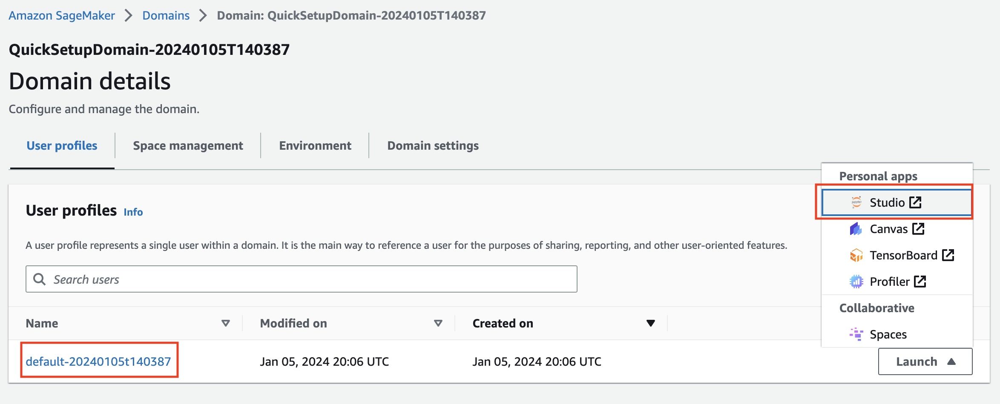
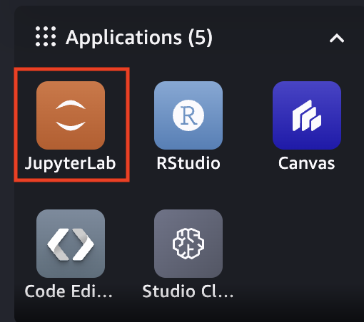
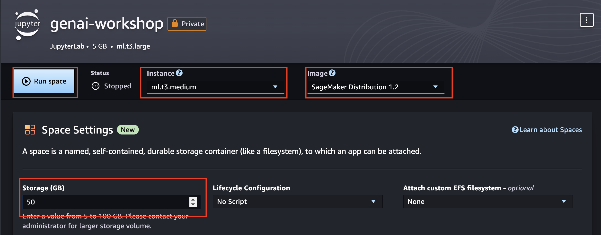

# GenAI With Amazon Bedrock

This hands-on workshop, aimed at developers and solution builders, introduces how to leverage foundation models (FMs) through [Amazon Bedrock](https://aws.amazon.com/bedrock/).
Amazon Bedrock is a fully managed service that provides access to FMs from third-party providers and Amazon; available via an API. With Bedrock, you can choose from a variety of models to find the one that’s best suited for your use case.

Within this series of labs, you'll explore some of the most common usage patterns we are seeing with our customers for Generative AI. We will show techniques for creating value for organizations by improving productivity. This is achieved

Labs include:

- **Text Generation** \[Estimated time to complete - 35 mins\]
- **Text Summarization** \[Estimated time to complete - 20 mins\]
- **Questions Answering** \[Estimated time to complete - 30 mins\]
- **Chatbot** \[Estimated time to complete - 60 mins\]
- **Agent** \[Estimated time to complete - 60 mins\]

## Getting started

### Choose a notebook environment

This workshop is presented as a series of **Python notebooks**, which you can run from the environment of your choice:

- For a fully-managed environment with rich AI/ML features, we'd recommend using [SageMaker Studio](https://aws.amazon.com/sagemaker/studio/). To get started quickly, you can refer to the [instructions for domain quick setup](https://docs.aws.amazon.com/sagemaker/latest/dg/onboard-quick-start.html).
- For a fully-managed but more basic experience, you could instead [create a SageMaker Notebook Instance](https://docs.aws.amazon.com/sagemaker/latest/dg/howitworks-create-ws.html).
- If you prefer to use your existing (local or other) notebook environment, make sure it has [credentials for calling AWS](https://docs.aws.amazon.com/cli/latest/userguide/cli-chap-configure.html).


### Enable AWS IAM permissions for Bedrock

The AWS identity you assume from your notebook environment (which is the [*Studio/notebook Execution Role*](https://docs.aws.amazon.com/sagemaker/latest/dg/sagemaker-roles.html) from SageMaker, or could be a role or IAM User for self-managed notebooks), must have sufficient [AWS IAM permissions](https://docs.aws.amazon.com/IAM/latest/UserGuide/access_policies.html) to call the Amazon Bedrock service.

To grant Bedrock and other permissions relevant for this workshop to your identity, you can:

- Open the [AWS IAM Console](https://us-east-1.console.aws.amazon.com/iam/home?#)
- Find your [Role](https://us-east-1.console.aws.amazon.com/iamv2/home?#/roles) (if using SageMaker or otherwise assuming an IAM Role), or else [User](https://us-east-1.console.aws.amazon.com/iamv2/home?#/users)
- Select *Add Permissions > Create Inline Policy* to attach new inline permissions, open the *JSON* editor and paste in the below example policy:

```
{
    "Version": "2012-10-17",
    "Statement": [
        {
            "Effect": "Allow",
            "Action": ["bedrock:*"],
            "Resource": "*"
        },
        {
            "Effect": "Allow",
            "Action": ["iam:*"],
            "Resource": "*"
        },
        {
            "Effect": "Allow",
            "Action": ["cloudformation:*"],
            "Resource": "*"
        },
        {
            "Effect": "Allow",
            "Action": ["aoss:*"],
            "Resource": "*"
        },
        {
            "Effect": "Allow",
            "Action": ["lambda:*"],
            "Resource": "*"
        }
    ]
}
```

> ⚠️ **Note:** With Amazon SageMaker, your notebook execution role will typically be *separate* from the user or role that you log in to the AWS Console with. If you'd like to explore the AWS Console for Amazon Bedrock, you'll need to grant permissions to your Console user/role too.

For more information on the fine-grained action and resource permissions in Bedrock, check out the Bedrock Developer Guide.


### Clone and use the notebooks
[Amazon SageMaker Studio](https://docs.aws.amazon.com/sagemaker/latest/dg/studio-updated.html) is the latest web-based experience for running ML workflows. Studio offers a suite of IDEs, including Code Editor, based on Code-OSS, Visual Studio Code - Open Source, a new JupyterLab application, RStudio, and Amazon SageMaker Studio Classic. For more information about the applications supported in Studio, see [Applications supported in Amazon SageMaker Studio](https://docs.aws.amazon.com/sagemaker/latest/dg/studio-updated-apps.html).

Given most of the lab contents are developed in juypter notebooks, we'll be using a Jupyterlab app within SageMaker Studio. 

### Launching a SageMaker Studio session
1. From [Amazon SageMaker console](https://console.aws.amazon.com/sagemaker), navigate to "**Domains**" in the left panel. 
2. Select the SageMaker Domain created for this workshop
3. Under User Profile tab, Idenfity the user assigned to you. Click the "**Launch**" drop down and select "**Studio**"



4. In the SageMaker Studio launcher, select "JupterLab" icon from the top left pane as shown below:



5. Click on "**Create JupyterLab Space" button on the top right corner:


6. Provide a name for the JupyterLab space, and select "**Create space**"

7. Configure *Instance*: ml.t3.medium, *Image*: SageMaker Distribution 1.2, *Storage*: 50 (GB), then click "Run space"




> ℹ️ **Note:** In JupyterLab, you can open a "System Terminal" to run these commands by clicking *File > New > Terminal*

Once your notebook environment is set up, clone this workshop repository into it.

```sh
sudo apt update && sudo apt install -y unzip
git clone https://github.com/aws-samples/bedrock-genai-workshop.git
cd bedrock-genai-workshop
```

## Content

This repository contains notebook examples for the Bedrock Architecture Patterns workshop. The notebooks are organised by module as follows:

### Intro

- [Simple Bedrock Usage](./00_Intro/bedrock_boto3_setup.ipynb): This notebook shows setting up the boto3 client and some basic usage of bedrock.

### Generation

- [Simple use case with boto3](./01_Generation/00_generate_w_bedrock.ipynb): In this notebook, you generate text using Amazon Bedrock. We demonstrate consuming the Amazon Titan model directly with boto3
- [Simple use case with LangChain](./01_Generation/01_zero_shot_generation.ipynb): We then perform the same task but using the popular framework LangChain
- [Generation with additional context](./01_Generation/02_contextual_generation.ipynb): We then take this further by enhancing the prompt with additional context in order to improve the response.

### Summarization

- [Small text summarization](./02_Summarization/01.small-text-summarization-claude.ipynb): In this notebook, you use use Bedrock to perform a simple task of summarizing a small piece of text.
- [Long text summarization](./02_Summarization/02.long-text-summarization-titan.ipynb): The above approach may not work as the content to be summarized gets larger and exceeds the max tokens of the model. In this notebook we show an approach of breaking the file up into smaller chunks, summarizing each chunk, and then summarizing the summaries.

### Question Answering

- [Simple questions with context](./03_QuestionAnswering/00_qa_w_bedrock_titan.ipynb): This notebook shows a simple example answering a question with given context by calling the model directly.
- [Answering questions with Retrieval Augmented Generation](./03_QuestionAnswering/01_qa_w_rag_bedrock_kb_opensearch.ipynb): We can improve the above process by implementing an architecure called Retreival Augmented Generation (RAG). RAG retrieves data from outside the language model (non-parametric) and augments the prompts by adding the relevant retrieved data in context.

### Chatbot

- [Chatbot using Llama2](./04_Chatbot/00_Chatbot_Llama2.ipynb): This notebook shows a chatbot using Llama2

### Agent

- This [lab](05_Agent/README.md) shows how you could build an LLM Agent using Agent for Amazon Bedrock. 
